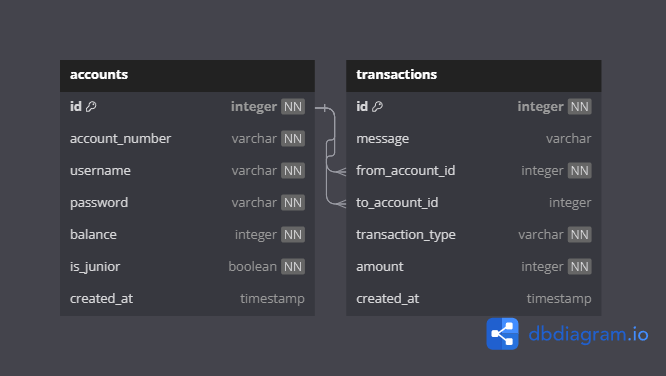

# 1. A rendszer célja

## Vágyálom rendszer

# 2. Adatbázis terv

# 3. Használt technológiák
- Trello - projekt szervezése, rendezése
- Discord - verbális kommunikáció
- Git, GitHub - Alkalmazás verzióinak követése
- Rajzolóprogramok az ábrákhoz(draw.io)
- Android Studio - fejlesztő környezet